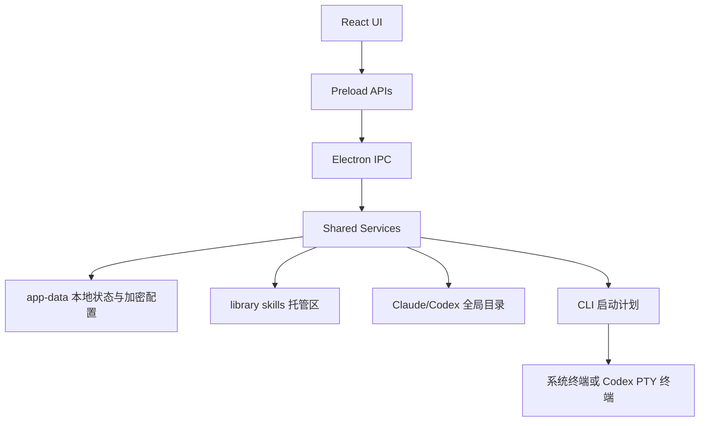

# CodeDeck

本机 AI CLI 管理桌面应用，用于集中管理 Claude Code 与 Codex 的 Skills、Profiles、模型映射、启动参数、权限配置和历史会话。

## 简介

CodeDeck 是一个基于 Electron 的本机桌面工具。它把 Claude Code 与 Codex 的本地 Skills、Profile 配置、启动命令、权限预设、会话恢复和运行时数据集中到一个图形界面中维护。

项目的核心价值是降低多 CLI、多账号、多模型网关场景下的配置成本。用户可以为 Claude Code 或 Codex 保存独立 Profile，设置 Base URL、API Key/Token、目标模型、工作目录、启动参数和权限策略，并在启动前查看最终命令与环境变量摘要。

与只编辑配置文件或手写启动脚本相比，本项目提供了本地扫描、预览、加密保存、受管理权限配置、Codex 隔离运行时、受监控终端和会话收藏等能力。项目不依赖后端服务；运行数据主要保存在项目根目录下的 `app-data/`。

> 说明：仓库根目录存在一些历史或辅助文件，例如 Python `requirements.txt`、根目录 `SKILL.md`、`.NET` 示例文件等。当前应用入口、构建、测试和打包流程由 `package.json`、`src/`、`electron/` 与 `docs/` 中的 Electron/React 代码和文档定义。

## 功能特性

- **Skills 管理**：扫描 Claude/Codex skills 目录，识别 `active`、`inactive`、`conflict`、`readonly` 状态，展示说明、标签、大小和路径。
- **集中托管与回滚**：通过 `library/codex/`、`library/claude/` 托管未启用 skill，启用/停用前生成预览，执行结果写入操作记录，并支持最近一次批次回滚。
- **项目级 Skills 复制**：支持选择项目目录，扫描项目内 skill 状态，并生成项目复制/移除预览与执行结果。
- **Profiles 启动器**：为 Claude Code 和 Codex 保存 Profile，配置 Base URL、API Key/Token、模型、工作目录、命令基名、启动模式、额外参数和环境变量。
- **加密配置存储**：Profile 与站点余额会话保存到 `app-data/claude_profiles.encrypted.json`，使用 Fernet 兼容格式和 PBKDF2-SHA256 派生密钥。
- **权限预设映射**：统一的权限模型会映射到 Claude Code `--permission-mode`、managed settings，以及 Codex `sandbox_mode`、`approval_policy`、managed rules。
- **Codex 运行时隔离**：Codex 启动使用应用内 `CODEX_HOME`，写入独立 profile config、provider、rules，并可继承全局 `.codex` 的 MCP、skills、marketplace/plugin 配置。
- **终端启动模式**：Claude 使用系统直连；Codex 支持系统直连和 PTY/ConPTY 受监控终端，受监控模式可捕获输出、处理粘贴/复制和自动继续。
- **会话恢复与收藏**：读取 Claude/Codex 历史会话，支持 Codex 应用运行时目录和用户全局 `.codex` 目录，并提供跨 provider 收藏。
- **模型和参数设置**：维护 Claude/Codex 模型别名、Codex `wire_api`、`skip_git_repo_check`、全局代理、遥测/错误报告/非必要流量开关和启动模式参数模板。
- **余额检测**：对 Profile 关联站点执行余额/配额查询，并可保存后台会话信息供多个 Profile 复用。

## 技术栈

- **桌面运行时**：Electron 38
- **前端**：React 19、TypeScript、Vite 7
- **终端能力**：`node-pty`、`@xterm/xterm`、`@xterm/addon-fit`
- **测试**：Vitest、`@testing-library/jest-dom`
- **构建与打包**：TypeScript、Vite、electron-builder、electron-rebuild
- **关键运行环境**：Node.js、npm、Claude Code CLI、Codex CLI

## 项目结构

```text
.
├── electron/                 # Electron 主进程、preload、IPC、窗口和终端控制
├── src/                      # React 渲染进程和共享业务逻辑
│   ├── App.tsx               # 主应用状态编排、页面切换、启动流程
│   ├── TerminalApp.tsx       # Codex 受监控终端窗口
│   ├── UnlockApp.tsx         # 加密配置解锁入口
│   ├── components/           # Profiles、Skills、Settings、Launcher 等 UI 组件
│   └── shared/               # 跨主进程/渲染进程复用的领域模型和服务
├── src/shared/__tests__/     # Vitest 单元和组件测试
├── scripts/                  # 打包准备、翻译合并、隐藏启动等辅助脚本
├── docs/                     # 当前维护文档索引
├── docs/specs/               # 产品规格、权限模型和实现说明
├── library/                  # 本机集中托管的 Codex/Claude skills
├── build/                    # electron-builder 资源，如图标和 workspace seed
├── app-data/                 # 本机运行数据、日志、运行时配置和加密 Profile
├── package.json              # npm 脚本、依赖和 electron-builder 配置
├── vite.config.ts            # Vite 与 Vitest 配置
├── tsconfig.app.json         # 渲染进程/应用 TypeScript 配置
├── tsconfig.node.json        # Electron 主进程 TypeScript 配置
├── LICENSE                   # MIT License
└── LICENSE.txt               # Windows 安装包使用的中文 EULA
```

未纳入上方目录树的 `node_modules/`、`dist/`、`dist-electron/`、`release/`、运行日志和缓存目录都不是日常阅读入口。

## 快速开始

### 1. 环境要求

- 安装 Node.js 与 npm。
- 如需真实启动 CLI，请先安装 Claude Code CLI 和/或 Codex CLI，并确保 `claude`、`codex` 命令可在系统 PATH 中调用。
- 当前开发脚本包含 Windows 风格环境变量写法，Windows 是仓库中最明确支持的本地开发环境。

`package.json` 没有声明固定 Node.js 版本；请以能够运行当前 Vite、Electron 与 TypeScript 依赖的 Node.js 版本为准。

### 2. 安装依赖

```bash
npm install
```

如果 Electron 原生模块出现 ABI 不匹配，可运行项目已有脚本重建 `node-pty`：

```bash
npm run rebuild:native
```

### 3. 启动开发环境

```bash
npm run dev
```

该命令会并行启动：

- `npm run dev:renderer`：以 `5173` 端口启动 Vite。
- `npm run build:electron:watch`：监听并编译 Electron 主进程代码到 `dist-electron/`。
- `npm run dev:electron`：等待 Vite 与关键入口可访问后启动 Electron。

### 4. 类型检查、测试与构建

```bash
npm run typecheck
npm test
npm run build
```

`npm run build` 会先执行类型检查，再执行 `vite build` 和 Electron 主进程编译。

### 5. 预览前端构建

```bash
npm run preview
```

### 6. 打包 Windows 应用

```bash
npm run dist:win      # Windows NSIS 安装包
npm run dist:win:dir  # Windows 目录包
npm run dist:win:zip  # Windows zip 包
```

打包配置来自 `package.json` 的 `build` 字段，产物输出到 `release/`，资源来自 `build/`，安装包许可文本使用 `LICENSE.txt`。

## 配置说明

项目没有 `.env.example` 或统一 `.env` 配置文件。主要配置由 UI 写入本地 JSON/TOML 文件，或在启动 CLI 时临时注入环境变量。

| 名称 | 是否必填 | 默认值 | 说明 |
| -- | ---: | --- | -- |
| `app-data/claude_profiles.encrypted.json` | 否 | 首次初始化后生成 | 加密保存 Profile 与站点余额会话。 |
| `app-data/local_state.json` | 否 | 首次运行后生成 | 保存 UI 状态、全局设置、参数设置、会话收藏、工作目录收藏等。 |
| `app-data/manifest.json` | 否 | 扫描后生成 | Skills 扫描索引、状态、缓存和最近成功操作信息。 |
| `app-data/operations/` | 否 | 执行批处理后生成 | 记录启用、停用、项目复制和回滚等操作结果。 |
| `app-data/backups/` | 否 | 执行需要备份的操作后生成 | 保存批处理前必要快照和备份元数据。 |
| `app-data/codex-runtime/home/` | 否 | Codex 启动前生成 | 应用隔离的 `CODEX_HOME`，包含 Codex profile config、rules 和会话运行数据。 |
| `app-data/claude-runtime/permissions/` | 否 | Claude 启动前生成 | Claude Code managed settings 文件目录。 |
| `app-data/runtime-overlays/` | 否 | 继承全局能力时生成 | Codex/Claude 全局 MCP、skills、plugins 等能力的运行时 overlay。 |
| `library/codex/` | 否 | 需要时创建或维护 | Codex 未启用 skills 的集中托管目录。 |
| `library/claude/` | 否 | 需要时创建或维护 | Claude 未启用 skills 的集中托管目录。 |
| `CLAUDE_PROFILE_LAUNCHER_PASSPHRASE` | 否 | 空 | 主进程可从该环境变量读取配置口令；通常也可通过 UI 解锁。 |
| `CODEDECK_KDF_ITERATIONS` | 否 | `480000` | 开发/测试时覆盖 PBKDF2 迭代次数；默认值写在 `src/shared/crypto/pbkdf2.ts`。 |

启动 Claude Code 时，应用会从 Profile 注入 `ANTHROPIC_BASE_URL`、`ANTHROPIC_AUTH_TOKEN` 和模型相关环境变量。启动 Codex 时，应用会注入隔离的 `CODEX_HOME` 与生成的 `CODEX_SITE_API_KEY_*` 环境变量。这些值来自本地 Profile，不应提交到仓库。

## 使用示例

### 管理 Skills

1. 打开应用后进入 Skills 页面。
2. 扫描 Codex 与 Claude 的 skills 目录。
3. 查看每个 skill 的状态、说明、标签、路径和体积。
4. 对选中的 skill 生成启用或停用预览。
5. 确认后执行批处理；需要恢复时使用“回滚上一次批次”。

对应服务入口包括 `CodeDeckSkillsService.scanEnvironment()`、`createPreview()`、`executeBatch()` 和 `rollbackLastSuccessfulBatch()`。

### 启动 Claude Code Profile

1. 在 Profiles 页面选择 Claude。
2. 填写 Profile 名称、Base URL、API Key/Token 和模型。
3. 设置工作目录、命令基名、启动模式、权限和额外参数。
4. 查看命令预览，确认环境变量摘要。
5. 启动后应用会写入受管理权限 settings，并通过系统终端执行 Claude Code。

Claude 命令构建器会根据启动模式生成 `--continue`、`--resume`、`--settings`、`--permission-mode`、`--model` 等参数。

### 启动 Codex Profile

1. 在 Profiles 页面选择 Codex。
2. 填写 Profile 名称、Base URL、API Key/Token 和模型。
3. 选择系统直连或受监控终端。
4. 启动前应用会写入 `app-data/codex-runtime/home/<profile>.config.toml` 和 `rules/managed-permissions.rules`。
5. 受监控终端模式会打开独立 Codex Terminal 窗口，并可按设置处理自动继续。

Codex 命令构建器支持 `resume --last`、`resume`、`resume --all` 和指定 session id 的恢复模式。

## 架构说明



主要协作关系：

- `src/App.tsx` 负责应用状态、页面切换、Profile 草稿、启动请求和会话列表编排。
- `electron/preload.ts` 暴露 `codeDeckSkills`、`profileManager`、`terminalManager` 等受控 API。
- `electron/main.ts` 注册 IPC handler，初始化服务，读写文件，执行 CLI 启动和终端通信。
- `src/shared/skills-service.ts` 管理 skills 扫描、预览、批处理、项目复制和回滚。
- `src/shared/services/profile-service.ts` 管理 Profile、运行时设置、选择状态、站点余额会话和本地状态。
- `src/shared/services/launch-service.ts` 生成命令预览和真实启动计划，并合并权限、参数和环境变量。
- `src/shared/services/model-mapping-config-service.ts` 写入 Codex runtime home、profile config 和 managed rules。
- `src/shared/services/capability-overlay-service.ts` 继承全局 Claude/Codex 能力，必要时使用目录链接或复制 fallback。
- `src/shared/services/session-service.ts` 读取 Claude/Codex 会话文件，合并 Codex index 与实际 session 文件，并支持导入全局 Codex 会话到应用 runtime home。

### 内部命名与 IPC

CodeDeck 的 Skills 能力仍然面向 Claude/Codex skills 目录，但内部入口已经统一使用 CodeDeck 品牌命名：

- Electron IPC 通道集中定义在 `src/shared/code-deck-ipc.ts`，当前前缀为 `codedeck:skills:*`。
- 主进程服务类为 `CodeDeckSkillsService`，实现文件为 `src/shared/skills-service.ts`。
- preload 暴露给渲染进程的受控 API 为 `window.codeDeckSkills`。

不再新增旧品牌 IPC、旧服务类名或旧 window API。新增 Skills 相关能力时，应复用 `CODEDECK_SKILLS_IPC_CHANNELS`，避免重新散落硬编码通道字符串。

## 开发指南

常用开发命令：

```bash
npm run dev
npm run typecheck
npm test
npm run test:watch
npm run build
```

代码组织建议：

- 共享领域模型和可测试逻辑优先放在 `src/shared/`。
- Electron-only 的窗口、文件、终端、IPC 编排放在 `electron/`。
- UI 控件按页面域放在 `src/components/`，避免把文件系统或 CLI 细节写进组件。
- 新增用户可见能力时，同步更新 `README.md` 和 `docs/specs/` 中对应主题文档。
- 修改权限、启动、Profile、会话或终端行为后，至少运行 `npm run typecheck` 和 `npm test`。
- 本机运行数据、会话记录、日志、构建产物和密钥文件由 `.gitignore` 拦截；提交前仍建议使用 `git status --short --untracked-files=no` 和白名单 `git add -- <files>` 复核。

当前仓库没有配置 ESLint、Prettier、Husky 或 CI workflow；不要在 README 中假设存在 lint 或自动发布流程。

### 本地数据与提交安全

`app-data/` 下会产生 Profile 加密文件、Codex/Claude runtime、session JSONL、日志、缓存、备份和运行时 overlay。除仓库已有的公开翻译/标签 JSON 外，这些内容默认不应进入 Git。

`.gitignore` 已覆盖以下高风险本地产物：

- `app-data/**`，但保留已有公开翻译/标签 JSON 例外。
- `.env*`、证书/私钥文件、数据库文件。
- `*.jsonl`、`*.log`、会话历史和本地日志。
- `dist/`、`dist-electron/`、`release/`、`release-*` 等构建/打包产物。
- `.playwright-mcp/`、`playwright-report/`、`test-results/` 等本地测试产物。

提交前不要使用无差别 `git add .`。涉及敏感配置或运行产物时，优先用白名单方式 stage 需要的源码和文档文件。

## 测试

测试框架由 `vite.config.ts` 配置为 Vitest，测试环境是 `node`，匹配范围是：

```text
src/shared/**/*.test.ts
src/shared/**/*.test.tsx
```

运行测试：

```bash
npm test
```

监听模式：

```bash
npm run test:watch
```

当前测试覆盖范围包括：

- skills 扫描、缓存、UI 状态和面板操作。
- Profile 保存、编辑器状态、权限卡片、启动面板和页面状态竞争。
- Claude/Codex 命令构建、URL 规范化、启动计划和权限配置生成。
- Codex runtime config、managed rules、capability overlay 和目录链接 fallback。
- 会话列表、收藏、Codex session index 合并、导入应用 runtime home。
- 加密存储、Fernet/PBKDF2、local state store。
- 终端自动继续、终端输入、PTY session manager。
- 余额检测、站点余额会话和展示状态。

`docs/specs/permissions.md` 明确说明权限测试不启动真实 Claude/Codex CLI，而是验证命令参数、settings/config/rules、权限摘要和 UI 行为。

## 部署与打包

项目没有 Dockerfile、docker-compose、Makefile、justfile 或 GitHub Actions 配置。当前有证据的发布方式是 `electron-builder` Windows 打包：

```bash
npm run dist:win
```

可选目录包和 zip 包：

```bash
npm run dist:win:dir
npm run dist:win:zip
```

打包时会执行 `npm run build`、`npm run prepare:package`，并把 `dist/`、过滤后的 `dist-electron/`、`package.json`、`build/workspace-seed` 和图标资源写入安装包。

## 常见问题

### 为什么首次启动需要解锁或初始化口令？

Profile 中包含 API Key/Token。项目使用加密文件保存这些配置，首次使用需要初始化口令，后续需要用口令解锁；主进程也支持从 `CLAUDE_PROFILE_LAUNCHER_PASSPHRASE` 读取口令。

### Codex 为什么使用 `app-data/codex-runtime/home/`？

`LaunchService` 会为 Codex 注入隔离的 `CODEX_HOME`，并由 `ModelMappingConfigService` 写入独立 profile config、provider 配置和 managed permission rules。这样可以避免直接污染用户全局 `.codex` 配置，同时保留按需继承全局能力的机制。

### 为什么没有写 Docker 或云部署？

项目是本机桌面应用，当前仓库没有 Docker、CI 或云部署配置。README 只记录已有脚本和 electron-builder 打包方式。

### `requirements.txt` 是否是当前应用依赖？

不是当前 Electron 应用的依赖入口。当前应用依赖和脚本以 `package.json`、`package-lock.json` 为准。

## 贡献指南

当前仓库没有 `CONTRIBUTING.md`。建议贡献流程：

1. 先阅读 [docs/README.md](docs/README.md) 和相关规格文档。
2. 修改前确认影响范围，尤其是 Profile、权限、启动、终端、运行时配置和本地数据结构。
3. 实现后运行 `npm run typecheck` 与 `npm test`。
4. 用户可见行为变更需要同步更新 `README.md` 或 `docs/specs/`。
5. 不要提交真实 API Key、Token、Cookie、个人路径、Profile 数据、运行时日志或本机生成配置。

## License

根目录 [LICENSE](LICENSE) 是 MIT License。

Windows 安装包使用 [LICENSE.txt](LICENSE.txt) 作为中文最终用户许可协议文本。
