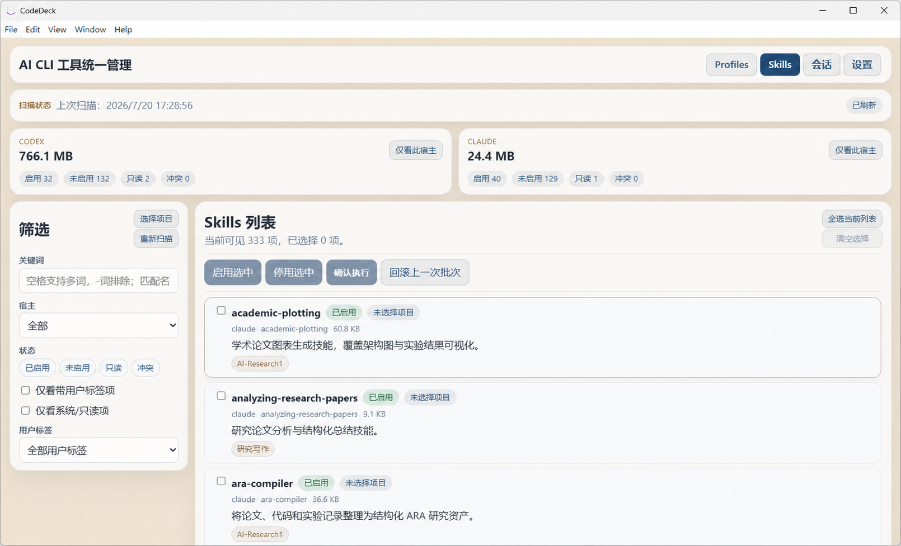
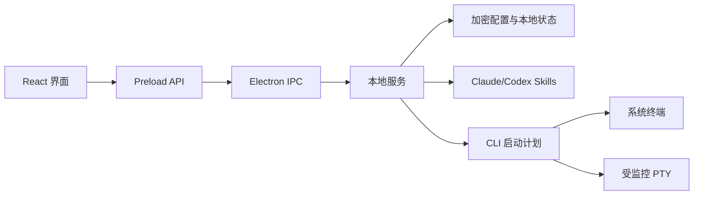

# CodeDeck

<p align="center">
  
</p>

<p align="center">
  <strong>在一个本地桌面应用里配置、启动并管理 Claude Code 与 Codex。</strong>
</p>

<p align="center">
  CodeDeck 面向同时使用多组账号、模型网关和工作目录的 Windows 开发者。它把 Profile、Skills、权限、历史会话和终端运行状态放到同一处管理，启动前还能检查最终命令和环境变量摘要。
</p>

<p align="center">
  <a href="https://github.com/tmdy/CodeDeck/actions/workflows/ci.yml"></a>
  <a href="LICENSE"></a>
</p>

<p align="center">
  <a href="#快速开始">快速开始</a> ·
  <a href="#界面预览">界面预览</a> ·
  <a href="https://github.com/tmdy/CodeDeck/releases">下载</a> ·
  <a href="docs/README.md">文档</a> ·
  <a href="CONTRIBUTING.md">参与贡献</a>
</p>

## CodeDeck 适合谁

手改 JSON、TOML 和启动脚本并不难，麻烦在于配置多了以后很难确认这次到底用了哪把 Key、哪个模型和哪套权限。CodeDeck 用 Profile 保存这些差异，并负责生成实际启动计划。

当前版本只支持 Claude Code 与 Codex，开发和打包流程以 Windows 为准。它的重点是配置完成后的运行过程：启动 CLI、隔离运行时、恢复会话，以及在受监控终端中继续工作。

## 界面预览



上图来自实际运行的 Windows 应用。公开版本裁掉了包含用户名和绝对路径的详情栏，没有使用设计稿替代产品界面。

## 已实现的功能

### Profile 与启动预览

每个 Profile 可以保存 Base URL、API Key 或 Token、模型、工作目录、启动模式、额外参数和环境变量。启动前会生成命令预览，并隐藏敏感值。

### 分开的权限模型

Claude Code 使用自己的 `--permission-mode` 和 managed settings；Codex 使用 `sandbox_mode`、`approval_policy` 与 managed rules。两套配置分别保存，也可以在单次启动时临时覆盖。

### 隔离的 Codex 运行时

Codex Profile 使用 CodeDeck 管理的 `CODEX_HOME`，不会直接改写用户的全局 `.codex` 配置。需要时，CodeDeck 会把全局 MCP、Skills 和已启用插件接入隔离目录。

### 受监控终端

Claude Code 和 Codex 都可以在 PTY 终端中启动。终端支持复制、粘贴、窗口标题同步和运行状态跟踪；Codex 还可以按失败关键字自动发送继续，并在运行中调整次数、间隔或暂停状态。

### Skills 管理

CodeDeck 扫描 Claude/Codex 的 Skills 目录，区分 `active`、`inactive`、`conflict` 和 `readonly`。启用、停用和项目复制会先生成预览；执行记录支持回滚最近一次成功批次。

### 会话恢复与收藏

会话页读取 Claude 与 Codex 的本地历史。Codex 会话可以同时来自应用运行时和用户全局 `.codex`，恢复前会按需导入隔离运行时。常用会话可以跨 Provider 收藏。

### 本地加密存储

Profile 和站点会话保存在本地加密文件中。当前实现使用 PBKDF2-HMAC-SHA256 派生密钥，并以 Fernet 兼容格式保存数据。口令丢失后无法恢复原数据。

功能边界和对应代码入口见[功能证据](docs/features.md)。

## 快速开始

Windows 用户可以从 [GitHub Releases](https://github.com/tmdy/CodeDeck/releases) 下载安装包。需要参与开发或查看当前源码时，按下面的步骤启动。

### 环境要求

- Windows 10/11 x64
- Node.js 22.12 或更高版本
- npm
- 如需真正启动 CLI，请先安装 Claude Code CLI 和/或 Codex CLI，并确保 `claude`、`codex` 位于 `PATH`

### 从源码启动

```powershell
git clone https://github.com/tmdy/CodeDeck.git
cd CodeDeck
npm ci
npm run dev
```

Vite 开发服务器固定使用 `5173` 端口；端口被占用时脚本会直接退出。应用启动后会先要求创建或输入本地加密口令，随后进入 Profiles 页面。

如果 `node-pty` 与当前 Electron ABI 不匹配，运行：

```powershell
npm run rebuild:native
```

更完整的安装和首次使用说明见[入门指南](docs/getting-started.md)。

## 一个常见用法

1. 在 Profiles 页面选择 Claude Code 或 Codex。
2. 新建 Profile，填写站点地址、凭据、模型和工作目录。
3. 选择系统直连或受监控终端，并检查命令预览。
4. 启动 CLI。之后可以在 Sessions 页面恢复本地历史会话。

Skills 页面是另一条独立流程：扫描本机 Skills，选择项目或全局范围，查看操作预览，再决定是否执行。

## 架构



应用本身没有配套后端。余额、签到、模型列表和 CLI 请求仍会访问用户配置的外部站点，因此“本地应用”不等于“完全离线”。

## 本地数据

开发模式默认把运行数据放在仓库的 `app-data/`，打包版本默认使用 Electron `userData` 下的 workspace。可以通过 `CodeDeck.project-root.txt` 或 `CODEDECK_PROJECT_ROOT` 选择其他工作区。

以下内容不应提交到 Git：

- Profile、API Key、Token、Cookie 和会话记录
- `app-data/` 中的运行时配置、日志和备份
- `library/` 中的个人 Skills 集合
- `dist/`、`dist-electron/`、`release/` 等构建产物

配置位置、环境变量和优先级见[配置说明](docs/configuration.md)。

## 开发与验证

```powershell
npm run typecheck
npm test
npm run build
```

其他常用命令：

```powershell
npm run test:watch
npm run dev:renderer
npm run build:electron
npm run dist:win
```

`npm run preview` 只预览 Vite Renderer，不是完整的 CodeDeck；主界面依赖 Electron preload API。

测试配置位于 `vite.config.ts`，当前匹配 `src/shared/**/*.test.ts` 和 `src/shared/**/*.test.tsx`。Windows 打包由 `electron-builder` 完成，产物写入 `release/`，不会自动发布。

开发环境、目录职责和发布前检查见[开发指南](docs/development.md)。

## 文档

- [入门指南](docs/getting-started.md)
- [功能证据](docs/features.md)
- [配置与本地数据](docs/configuration.md)
- [开发与打包](docs/development.md)
- [常见问题](docs/troubleshooting.md)
- [权限模型](docs/specs/permissions.md)
- [V1 设计背景](docs/specs/2026-05-02-codedeck-v1.md)

## 参与贡献

提交修改前请阅读 [CONTRIBUTING.md](CONTRIBUTING.md)。安全问题请按 [SECURITY.md](SECURITY.md) 中的方式报告，不要在公开 Issue 中粘贴凭据或完整运行日志。

## 友情链接

- [LinuxDo](https://linux.do) — 开发者交流社区。

## License

源码使用 [MIT License](LICENSE)。Windows 安装器展示的 [LICENSE.txt](LICENSE.txt) 是中文说明文本；它不替代仓库根目录的 MIT License。
